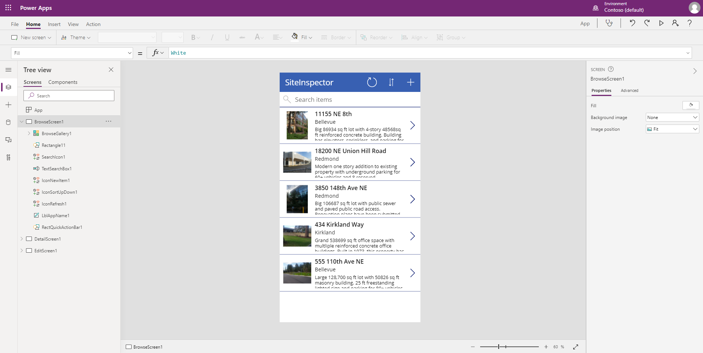

# Build an app without using any code with Microsoft Power Platform

## Learn module

[How to build a canvas app](https://docs.microsoft.com/en-us/learn/modules/build-app-solution/)

## Goals

In this workshop, we will discuss how to build a no-code app, the low-code way with PowerApps.

| **Goal**                                          | Description                                                                                                    |
| ------------------------------------------------- | -------------------------------------------------------------------------------------------------------------- |
| **What will you learn**                           | How to build and customize an app with PowerApps, get introduced to all its elements|
| **What you'll need**                              | [M365 subscription](https://developer.microsoft.com/en-us/microsoft-365/dev-program) mc_id=academic-56258-chrhar)                                          |
| **Duration**                                      | Roughly 1 hour |
| **Slides**                                        | [Powerpoint](slides.pptx)                                                                                      |

## Video

Video coming soon...

## Pre-Learning

- [Introduction to Power Platform](https://docs.microsoft.com/en-us/learn/modules/introduction-power-platform/)

## Prerequisites

- [M365 subscription](https://developer.microsoft.com/en-us/microsoft-365/dev-program) 

## What students will learn

Do you have a problem statement in mind? And think an app can solve it? But the amount of development knowledge required to get started building an app is stopping you? If that's an yes, turn your ideas into reality with Microsoft PowerApps.

## Workshop flow

### Setup your environment

If you have M365 subscription with you, all that you need to do is, visit (PowerApps studio)[https://make.powerapps.com] and sign in with your account. If not, you can learn how to [configure and setup an environment](https://docs.microsoft.com/en-us/power-platform/admin/create-environment#:~:text=%20Steps%20%201%20Sign%20in%20to%20the,Save.Table%203SettingDescriptionLanguageThe%20default%20language%20for%20this...%20See%20More.)

### Create the app

After setting up the environment, attendees will start creating the app, by simply clicking on 'Create' from the left pane.

### Choosing data

For this workshop, attendees can use the data given in the [zip file](data/Contoso-Site-Tracking.zip), extract and upload them on One-drive and then choose One-drive for business as a data-source.

### Exploring the various elements

To add more detailings to the app, attendees can explore the various [elements](https://docs.microsoft.com/en-us/learn/modules/build-app-solution/2-learn-basic-elements) and services.

## Next steps

- [Adding logic to the app using functions](https://docs.microsoft.com/en-us/learn/modules/build-app-solution/4-get-started-functions-power-apps)
-[Sharing the app](https://docs.microsoft.com/en-us/learn/modules/build-app-solution/5-share-app)
- [Learning more about PowerApps](https://docs.microsoft.com/en-us/learn/modules/get-started-with-powerapps/)

## Feedback

Be sure to give [feedback about this workshop](https://forms.office.com/r/MdhJWMZthR)!

[Code of Conduct](CODE_OF_CONDUCT.md)
