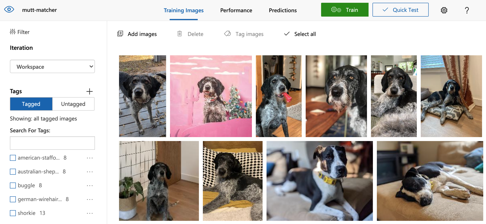

# Build a Machine Learning Model

## Overview

Azure [Custom Vision](https://docs.microsoft.com/azure/cognitive-services/custom-vision-service/?WT.mc_id=academic-49102-chrhar) allows you to create models which can classify and detect items in images. You could use this to detect a breed of dog, if someone is wearing a helmet, or the presence of other features. While this could be done by using code and manually processing the images, Custom Vision provides a web-based interface and tooling to streamline the process. No prior knowledge of machine learning or math is required!

Over the course of this workshop you will build a model to detect dog breeds. You'll start by installing and configuring the necessary tools, then creating the custom model by uploading and tagging images, and finally use the model with a software development kit (SDK).

| **Project Goal**              | Learn about Custom Vision AI and how to use it to train and test images                                    |
| ----------------------------- | --------------------------------------------------------------------- |
| **What will you learn**       | Use images to train a model to be able to perform inference to classify images                                        |
| **What you'll need**          | Python 3.8+, Visual Studio Code |
| **Duration**                  | 1 hour                                                                |
| **Just want to try the app or see the solution?** | [Solution](./solution)                         |
| **Slides** | [Powerpoint](https://microsoft-my.sharepoint.com/:p:/p/chrhar/EVWxM2va_G9NuQ4-F23VmlwBZKWxckUWBToScPFcMBjU_g?e=rjktes)
| **Author** | [Christopher Harrison](https://aka.ms/geektrainer)

## What you'll build with CustomVision.ai



## Prerequisites

### Python 3.8 or greater, including pip

To test if you have Python and pip installed, open a command or terminal window and run the following commands.

```bash
python3 --version
pip3 --version
```

If Python and pip are installed a version number will be displayed, such as *3.8.10*. Otherwise, an error message is displayed. You can install Python and pip as needed:

- [Windows](https://docs.microsoft.com/windows/python/beginners?WT.mc_id=academic-49102-chrhar#install-python)
- [MacOS](https://www.python.org/downloads/macos/)
- [Linux](https://packaging.python.org/guides/installing-using-linux-tools/)

### Visual Studio Code

The instructions for this workshop assume you are using [Visual Studio Code](https://code.visualstudio.com?WT.mc_id=academic-49102-chrhar), an open source code editor. You will also need the [Pylance extension](https://marketplace.visualstudio.com/items?itemName=ms-python.vscode-pylance&WT.mc_id=academic-49102-chrhar), which will provide additional functionality when writing Python.

## The workshop

- [Part 0: Install and configure tools](./setup.md)
- [Part 1: Train your model](./train.md)
- [Part 2: Test your model](./predict.md)
