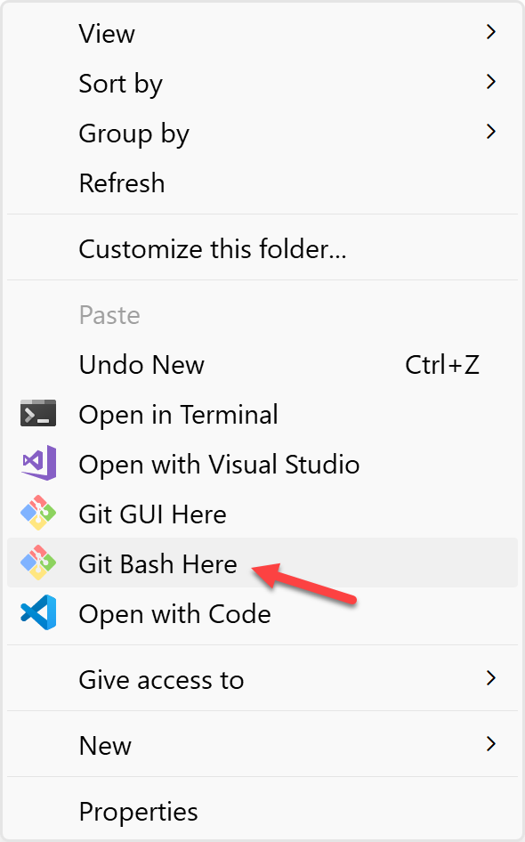

# Part 1: Working with a Local Repository

Git tracks changes in your source code, enables versioning, and supports non-linear development through thousands of parallel branches without the need for the internet.

## Initializing a Local Git Repository

1. On your local machine, create a new empty folder.
2. Right-click inside the folder and select **Git Bash Here** from the options.

    

3. Inside git bash, execute the following command to initialize a Git repository
   
    ```bash
    git init
    ```

## Making Changes

1. Inside git bash, execute the following command to create a new file

    ```bash
    touch new-text-file.txt
    ```

2. Inside git bash, execute the following command to open the newly created file

   ```bash
    start new-text-file.txt
    ```

3. Add some text to the file then save and close it.

Common shell commands:
  ```bash
  $ ls    # used to list files and directories
  $ mkdir # used to create a new directory
  $ cd    # used to change directories
  $ rm    # used to remove files and directories
  $ pwd   # used to print the current working directory
  $ touch # used to create and modify files
  $ start # used to open files or directories using the default program
  ```

## Staging Changes

In Git, just because a file was modified doesn't mean it will be automatically included in the next commit. Instead, you have to tell Git explicitly which of your modifications shall be part of the next commit. This is done by adding a change to the Staging Area or, put simply, by "staging" it.

Inside git bash, execute the following command to stage all the changes

```bash
git add .
```

> [!NOTE]
> The dot (.) here means all the changes instead of using it we can add the names of each changed file individually.

## Committing Changes

$ git commit

## Reviewing the Repository's History

$ git status

On branch main
No commits yet
nothing to commit (create/copy files and use "git add" to track)


$ git log

$ git log --oneline
• the SHA 
• the author 
• the date
• the commit message

## Summary

Congratulations! You are now able to use Git on your local machine to manage your projects. Next you'll practice [working with remotes](./remote-github.md).
