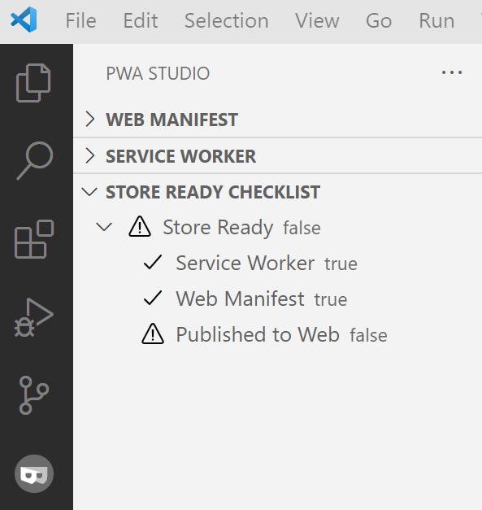
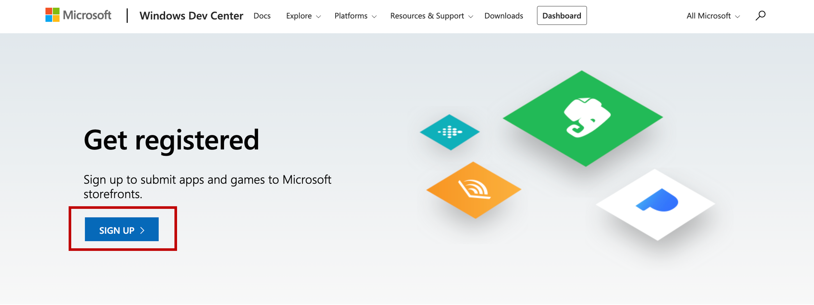
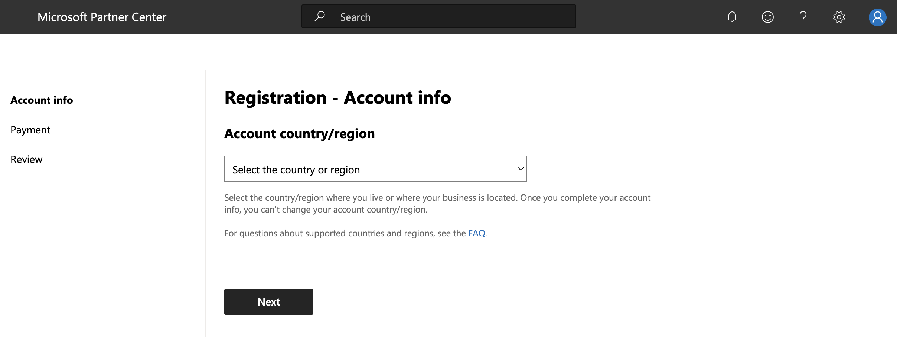

[⏮️ Ir al paso anterior](6-notificaciones.md)

# Auditoría y empaquetado de tu PWA para distribuir en tiendas de aplicaciones

En este paso, auditaremos la PWA para asegurarnos de que sea instalable y lista para publicar. También empaquetaremos la PWA para que esté lista para distribuirse en tiendas de aplicaciones.

## Auditoría con PWA Studio

Puede hacer esto directamente en VSCode con la extensión PWA Studio. Navegue por el panel de extensiones y revise cada sección: manifiesto web, service worker y lista de verificación de tienda. Se ve así:

Además puede realizar la auditoría a través de otras herramientas como [PWABuilder](https://aka.ms/learn-pwa/workshop/30days-3.5?id=audit-with-pwabuilder) y [Lighthouse en las herramientas de desarrollo de Edge](https://aka.ms/learn-pwa/workshop/30days-3.5?id=audit-performance-with-lighthouse-and-devtools).

## Empaquetar tu PWA

Hay varias formas de empaquetar tus PWAs. Puedes seguir los pasos a continuación para empaquetar con la extensión PWA Studio:

1. Primero asocia tu PWA con una URL. Presiona `ctrl-shift-P` en VS Code. Busca `PWA Studio: Set App URL`. Selecciona `Sí` y proporciona la URL de la aplicación web estática de Azure que desplegaste en el paso 3.
2. Teclea `ctrl-shift-P` en VS Code de nuevo. Busca `PWA Studio: Package your PWA`. Selecciona la plataforma para la que deseas empaquetar tu PWA y sigue las instrucciones. ¡Felicidades, se generará tu paquete PWA!

También puedes empaquetar tu PWA a través del sitio [pwabuilder.com](https://aka.ms/learn-pwa/workshop/pwabuilder.com). Aquí están los [pasos de empaquetado de la documentación de PWABuilder](https://aka.ms/learn-pwa/workshop/docs.pwabuilder.com/builder/windows?id=packaging).

## Envía tu aplicación a la Microsoft Store

Va a usar la Microsoft Store como ejemplo y ver cómo puede enviar su aplicación.

### Registro en Windows Dev Center

1. Dirígete a [Windows Dev Center](https://aka.ms/learn-pwa/workshop/developer.microsoft.com/windows) y haz clic en Registro. Serás llevado a la [página de registro de la tienda](https://aka.ms/learn-pwa/workshop/developer.microsoft.com/microsoft-store/register). Haz clic en el botón REGISTRARSE.

1. Ahora serás redirigido a una página de inicio de sesión. Inicia sesión con tu cuenta de Microsoft (@hotmail, @outlook, etc.). Si no tienes una cuenta de Microsoft, puedes crear una [aquí](https://aka.ms/learn-pwa/workshop/outlook.live.com/owa).
2. Una vez que has iniciado sesión, deberías ser redirigido al sitio de Microsoft Partner Center en la página Registro - Información de la cuenta. Sigue los pasos de configuración para crear tu cuenta. Selecciona 'Individual' como tipo de cuenta si planeas enviar aplicaciones como tú mismo.

1. Después de completar la información básica, llegarás a la página Registro - Pago. Si estás registrado como [Student Ambassador](http://aka.ms/mlsa), deberías tener acceso a la suscripción Visual Studio Enterprise. Esto proporciona un código promocional para que puedas ahorrar $19 USD en el proceso de registro. Para hacer esto, dirígete a la [página de suscripciones de Visual Studio](https://aka.ms/learn-pwa/workshop/my.visualstudio.com/Benefits) e inicia sesión con la cuenta con el beneficio de suscripción Visual Studio Enterprise. Navega por la página para encontrar el beneficio de cuenta de desarrollador de Windows y haz clic en el botón Ver código. Copia el código en el formato de XXXXX-XXXXX-XXXXX-XXXXX-XXXXX.

1. Introduce el código promocional copiado en el último paso o paga con tu método preferido en la página Registro - Pago del sitio de Microsoft Partner Center.

1.  Ahora revisa la información de tu cuenta, acepta los términos y condiciones del Acuerdo de desarrollador de aplicaciones y haz clic en el botón Finalizar en la página Registro - Revisión.

### Reserva tu app

1. Después de registrarte en Partner Center, dirígete a tu [panel de control](https://aka.ms/learn-pwa/workshop/partner.microsoft.com/dashboard/home).
2. Navega a `Apps y juegos`. Dependiendo de tu historial de visitas de la página, haz clic en el botón `Crear una nueva aplicación` o haz clic en el botón `+ Nuevo Producto` y selecciona App.
3. Escriba el nombre de su aplicación. **Asegúrese de que este nombre sea el mismo que se indica en su manifiesto. Cuando llegue el momento de cargar sus paquetes de aplicaciones, se verificará si el paquete coincide con el nombre de la aplicación registrada.**
4. Una vez que se haya reservado el nombre, podrá acceder a la información de su paquete a través de la pestaña `Identidad del producto`. Registre `ID de paquete`, `ID de editor` y `Nombre de editor` ya que estos serán necesarios ya sea que esté empaquetando a través de PWA Studio o el sitio PWABuilder.

### Envía a la tienda

1. Regresa a tu [panel de control](https://aka.ms/learn-pwa/workshop/partner.microsoft.com/dashboard/home) en Partner Center y selecciona la lista que creaste de la lista.
2. Haz clic en `Empezar tu envío` y selecciona la sección `Paquetes`. Arrastra y suelta los paquetes generados. Haz clic en `Guardar`.
3. Rellena el resto de las secciones de envío de tu aplicación para finalizar el envío a la tienda. Tenga en cuenta que puede tardar hasta 48 horas en completarse el proceso de revisión.

## Resumen y próximos pasos

¡Felicidades! Ha terminado este taller de generar una PWA para enviarla a la Microsoft Store. Puede continuar desarrollando sus habilidades en PWA explorando los recursos como [30 Días de PWA](https://aka.ms/learn-pwa/30days-blog) o [Documentación de Microsoft Edge acerca de PWA](https://aka.ms/learn-pwa/workshop/docs.microsoft.com/microsoft-edge/progressive-web-apps-chromium).

## Recursos
- [30 Días de PWA: 3.5 Herramientas de auditoría](https://aka.ms/learn-pwa/workshop/30days-3.5)
- [30 Días de PWA: 3.6 Herramientas de automatización de pruebas](https://aka.ms/learn-pwa/workshop/30days-3.6)
- [30 Días de PWA: 3.7 Herramientas de empaquetado](https://aka.ms/learn-pwa/workshop/30days-3.7)
- [30 Días de PWA: 4.3 Mejores prácticas para distribuir su PWA](https://aka.ms/learn-pwa/workshop/30days-4.3)
- [Documentación de Microsoft Edge: Publicar una Progressive Web App en la Microsoft Store](https://aka.ms/learn-pwa/workshop/docs.microsoft.com/microsoft-edge/progressive-web-apps-chromium/how-to/microsoft-store)
