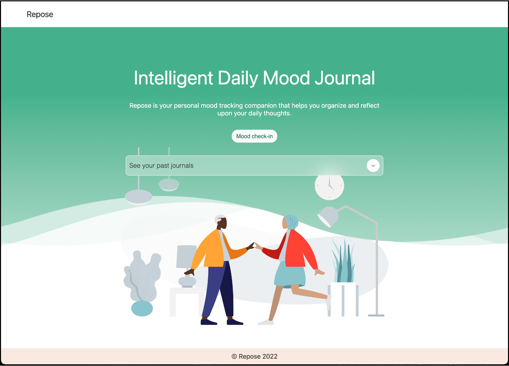

# Construye un Diario de estado de ánimo como Aplicación Web Progresiva

## Descripción
¿Alguna vez has escuchado sobre las Aplicaciones Web Progresivas (PWA) en las últimas tendencias de desarrollo web? ¿Quieres construir aplicaciones web que puedan ser instaladas en diferentes plataformas, ser independientes de la red, funcionar sin conexión y aprovechar las capacidades específicas de la plataforma como las notificaciones? En este taller, te llevaremos a través del proceso de cómo comenzar a construir una Aplicación Web Progresiva y desplegarla en la Microsoft Store. 🧠

## Objetivos

| **Objetivo** | *Construye un diario de estado de ánimo como una increíble aplicación web progresivamente mejorada* |
| -------- | -------------------------------------------------------------- |
| **Lo que aprenderás** | Construye, audita y empaqueta tu primera Aplicación Web Progresiva |
| **Lo que necesitarás** | Un navegador web moderno como [Microsoft Edge](https://aka.ms/learn-pwa/workshop/edge). Un editor de código como [Visual Studio Code](https://aka.ms/learn-pwa/workshop/vscode). [Git](https://git-scm.com/downloads). [Node.js](https://nodejs.org/en/). |
| **Duración** | 1 - 1.5 horas |
| **Temas de Microsoft Cloud que se enseñan** | Aplicaciones Web Estáticas de Azure |
| **¿Solo quieres probar la aplicación o ver la solución?** | [Repose](https://gentle-mud-08de3661e.1.azurestaticapps.net/) |
| **Diapositivas** | [Powerpoint](diapositivas.pptx) |
| **Autor** | [Beth Pan](https://twitter.com/beth_panx) |

## Requisitos previos
- Conocimientos básicos de HTML, CSS y JavaScript. Si necesitas repasar tus habilidades web, puedes revisar [este módulo de Microsoft Learn](https://aka.ms/learn-pwa/workshop/docs.microsoft.com/learn/modules/build-simple-website/) o [este taller](https://aka.ms/learn-pwa/workshop/github.com/microsoft/workshop-library/tree/main/full/build-resume-website).
- Un navegador web moderno como [Microsoft Edge](https://aka.ms/learn-pwa/workshop/edge). Las PWA son compatibles con la mayoría de los navegadores web modernos, pero para facilitar este taller usaremos [Microsoft Edge](https://aka.ms/learn-pwa/workshop/edge).
- Un editor de código como [Visual Studio Code](https://aka.ms/learn-pwa/workshop/vscode).
- Una [cuenta de Azure](https://aka.ms/learn-pwa/workshop/azure.microsoft.com/free/students/) si quieres desplegar tu aplicación en un punto final seguro.
- [Git](https://git-scm.com/downloads) para clonar las soluciones de muestra.
- [Node.js](https://nodejs.org/en/) para ejecutar las soluciones de muestra.
- Una [cuenta de Microsoft](https://aka.ms/learn-pwa/workshop/outlook.live.com/owa) que puedas registrar como cuenta de desarrollador para publicar tu aplicación en la Microsoft Store. Necesitarás pagar $19 USD por los servicios de la cuenta para publicar tu aplicación en la Microsoft Store. Ten en cuenta que si tienes una suscripción de Visual Studio Enterprise, obtienes un código promocional para publicar tus aplicaciones de forma gratuita.

## Lo que aprenderás

Para el final de este taller, crearás un diario de estado de ánimo como aplicación web progresiva que se puede instalar en diferentes plataformas, ser independiente de la red, funcionar sin conexión y aprovechar las capacidades específicas de la plataforma, como las notificaciones.

## Pasos del taller

0. [Configura tu entorno.](0-instalación.md)
1. [Crea una nueva aplicación web progresiva usando PWA Studio.](1-crear-pwa.md) ([solución: 01-starter](../../solution/01-starter/))
2. [Agrega funcionalidades como el seguimiento de estado de ánimo y el diario.](2-agregar-contenido.md) ([solución: 02-repose](../../solution/02-repose/))
3. [Haz que la PWA sea segura - despliega la PWA en un punto final HTTPS.](3-despliegue-en-Azure.md) ([solución: 03-repose-PWA](../../solution/03-repose-PWA/))
4. [Haz que la PWA sea instalable - agrega un manifiesto de aplicación web a la PWA.](4-agregar-manifiesto-web.md) ([solución: 03-repose-PWA](../../solution/03-repose-PWA/public/manifest.json))
5. [Haz que la PWA sea independiente de la red y funcione sin conexión - registra un service worker para la PWA.](5-registrar-trabajador-de-servicio.md) ([solución: 03-repose-PWA](../../solution/03-repose-PWA/))
6. [Haz que la PWA sea atractiva - habilita las notificaciones push.](6-notificaciones.md) ([solución: 04-notificaciones](../../solution/04-notifications/))
7. [Audita y empaqueta la PWA para distribuirla en las tiendas de aplicaciones.](7-listo-para-la-tienda.md)

## Comentarios

Asegúrate de dejarnos [comentarios sobre este taller](https://forms.office.com/r/MdhJWMZthR)!

[Código de conducta](../../../../CODE_OF_CONDUCT.md)

