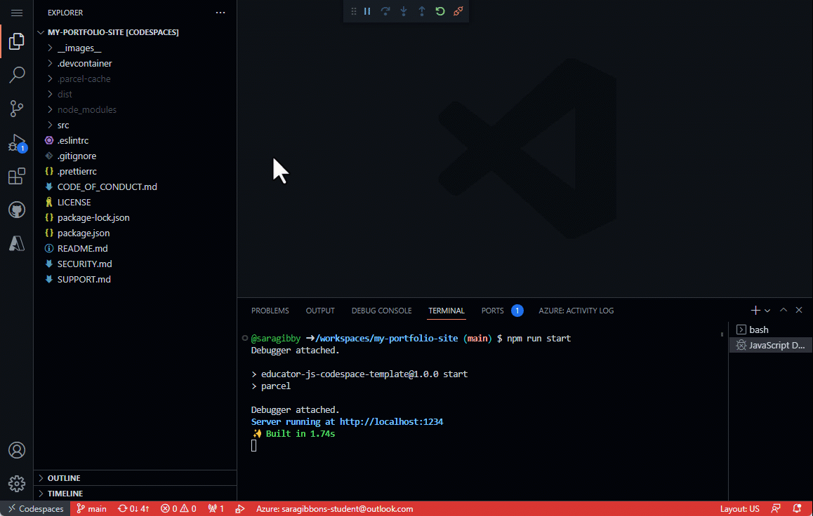

# JavaScript Portfolio Site with GitHub Codespaces

_Create, customize and deploy your own portfolio website in minutes._ ✨

In this template repository we have the development environment, base project and deployment steps set and ready so that you can immediately launch the Codespace to customize your own portfolio web application with no setup.

Built to be a "choose your own adventure" template repository portfolio, we have a [React](https://reactjs.org/) based web application ready for you to easily customize and deploy using only your web browser. _No web development experience required._

## About Codespaces

Using Codespaces, you get [Visual Studio Code](https://visualstudio.microsoft.com/?WT.mc_id=academic-77460-alfredodeza) in the cloud, using a ["development container"](https://containers.dev/). Like a locally running version of [Visual Studio Code](https://visualstudio.microsoft.com/?WT.mc_id=academic-77460-alfredodeza), the cloud version also allows you to install extensions and use a terminal.

You can also configure your development container to run a specific runtime and have it boot up with your favorite extensions.

## What you will learn and requirements for this workshop

| **Goal**              | Description                                    |
| ----------------------------- | --------------------------------------------------------------------- |
| **What will you learn**       | customizing Codespaces, web development, and web application deployment              |
| **What you'll need**          | <ul><li>[GitHub account](https://github.com)</li><li>access to [Codespaces](https://github.com/features/codespaces)</li><li> optional [Azure for Students](https://azure.microsoft.com/en-us/free/students/) or [Azure](https://azure.microsoft.com/en-us/free/search/) account for deployment</li></ul> |
| **Duration**                  | 35 minutes                                                                |
| **Slides**                  | [slides](./slides.pptx) |

 

## 🗃️ Link for this template and it's resources

This template [JavaScript Portfolio Site with GitHub Codespaces](https://github.com/microsoft/codespaces-project-template-js) includes all the resources you **will need in order to demonstrate the full presentation to your audience**.

Within this workshop, there is [3 points of customization](https://github.com/microsoft/codespaces-project-template-js#-customize-your-site-in-3-steps) included in the project template repository to be included. This will allow each attendee to customize their own site.

Beyond 3 points of customization, there are [4 challenge tasks](https://github.com/microsoft/codespaces-project-template-js#-challenges). These allow you to customize this workshop to your audience and time you;d like to spend.

Follow the [getting started instructions](https://github.com/microsoft/codespaces-project-template-js#-getting-started) to get your workshop attendees started with their poject launched within [Codespaces](https://github.com/features/codespaces). 

 

## 🏃 Deploy your web application

Project includes the setup needed for you to deploy **free** to both <a href="https://azure.microsoft.com/en-in/products/app-service/static/" target="_blank">Azure Static Web Apps</a> and <a href="https://pages.github.com/" target="_blank">GitHub Pages</a>.

### Azure Static Web Apps

<a href="https://azure.microsoft.com/en-in/products/app-service/static/" target="_blank">Azure Static Web Apps</a> is Microsoft's hosting solution for static sites (or sites that are rendered in the user's browser, not on a server) through Azure. This service provides additional opportunities to expand your site through Azure Functions, authentication, staging versions and more.

You'll need both Azure and GitHub accounts to deploy your web application. If you don't yet have an Azure account you can create it from within during the deploy process, or from below links:

* [Create a (no Credit Card required) Azure For Students account](https://azure.microsoft.com/free/students/)
* [Create a new Azure account](https://azure.microsoft.com/en-US/)

With your project open in Codespaces:

1. Click Azure icon in the left sidebar. Log in if you are not already, and if new to Azure, follow the prompts to create your account.
1. From Azure menu click “+” sign and then “Create Static Web App”.
1. If you are not logged into GitHub you will be prompted to log in. If you have any pending file changes you will then be prompted to commit those changes.
1. Set you application information when prompted:
    1. **Region**: pick the one closest to you
    1. **Project structure**: select "React"
    1. **Location of application code**: `/`
    1. **Build location**: `dist`
1. When complete you will see notification at the bottom of your screen, and a new GitHub Action workflow will be added to your project. If you click “Open Action in GitHub” you will see the action that was created for you, and it is currently running.

### GitHub Pages

<a href="https://pages.github.com/" target="_blank">GitHub Pages</a> allows you to host websites directly from your GitHub repository. This project is already set up for you to get your portfolio deployed to GitHub pages with minimal steps.

With your project open in Codespaces:

1. Open `package.json` and update the following values:
    1. **homepage**: set to `http://{github-username}.github.io/{repo-name}`, where `github-username` is your GitHub username and `repo-name` is the what you named this portfolio repo when you created it
    1. **build-gh**: replace `github-username` with your GitHub username and `repo-name` with the repository name
1. Commit and push those changes to `package.json` to your GitHub remote repo.
1. Open a new terminal from the menu or by pressing `ctrl` + `shift` + ` (or open top left menu, select "Terminal" and "New Terminal")
1. Within the terminal window run `npm run deploy`. This will first run the pre-deploy script to build the project, followed by the deploy script that will push those bundled files to a new branch on your repo (gh-pages) that will be used for you GitHub Pages site.
1. When completed, within your repo, go to Settings and Pages. There you will see that a page has been set up to for you against the gh-pages branch, and you should see the URL (that should match the “homepage” value you set in package.json)

 

## 📚 Resources

- [Codespaces](https://github.com/features/codespaces)
* [GitHub Codespaces docs overview](https://docs.github.com/codespaces/overview)
* [Use dev containers locally with VS Code and Docker](https://github.com/microsoft/vscode-remote-try-node#vs-code-dev-containers)

> #### Codespaces Browser App
>
> If you are using Edge or Chrome you will see an option to install the Codespaces app when you launch your Codespace. The Codespaces app lets you launch your Codespace within the app so you can work outside of the browser.  Look for the app icon and install pop-up to try it out.
>
> 

 

## 🔎 Feedback

Be sure to give [feedback about this workshop](https://forms.office.com/r/MdhJWMZthR)!

[Code of Conduct](../../CODE_OF_CONDUCT.md)
